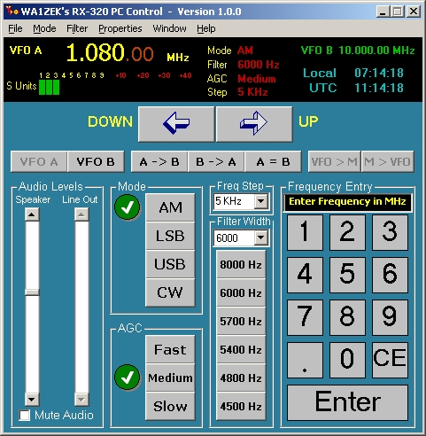



## TenTec RX320 Shortwave Receiver control App

### Description

Control Program for the TenTec "Black Box" Shortwave Receiver. This App is not complete, but fuctional. A lightweight PC control app for the RX320, used mostly by me as a spare Ham Radio receiver. I have included in the ZIP the Ten-Tec RX320 Programmers manual and the service manual (PDF files) for reference in showing how the code module that talks to the radio works. I have no plans to extend or finish this at this time, so I send it out to the world here for anyone to play with. 73 de WA1ZEK / VK2IFH
 
### More Info
 

             |
---                |---
**Submitted On**   |2005-06-30 07:15:20
**By**             |[Mark Mokoski](https://github.com/Planet-Source-Code/PSCIndex/blob/master/ByAuthor/mark-mokoski.md)
**Level**          |Intermediate
**User Rating**    |5.0 (20 globes from 4 users)
**Compatibility**  |VB 6\.0
**Category**       |[Miscellaneous](https://github.com/Planet-Source-Code/PSCIndex/blob/master/ByCategory/miscellaneous__1-1.md)
**World**          |[Visual Basic](https://github.com/Planet-Source-Code/PSCIndex/blob/master/ByWorld/visual-basic.md)
**Archive File**   |[TenTec\_RX3190821722005\.zip](https://github.com/Planet-Source-Code/mark-mokoski-tentec-rx320-shortwave-receiver-control-app__1-61468/archive/master.zip)

